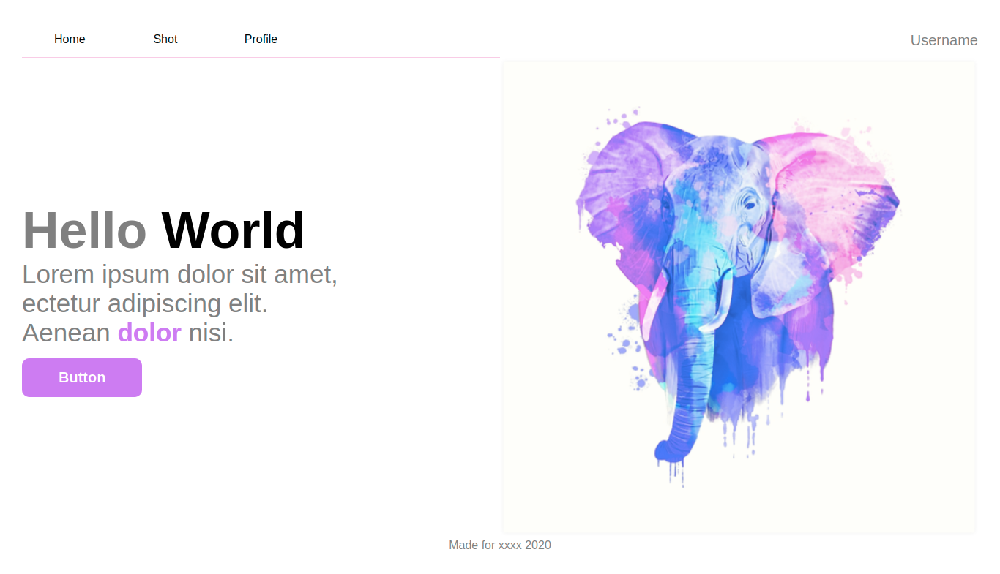
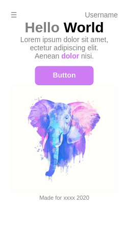

# :computer: Basic Landig Page :blush:

In this project i used **[Prepros](https://prepros.io/)** to create the SCSS.min

### You can see the project in production here: **[Live Demo](https://dfloresdev.github.io/basic-landing-page/)**

## Views :eyes:

### 1. Desktop

### 2. Mobile

## Follow me [dflores.dev](https://dflores.dev/)

### Anywhere @dfloresdev

You can contribute on [this link](https://github.com/dfloresdev/basic-landing-page)
